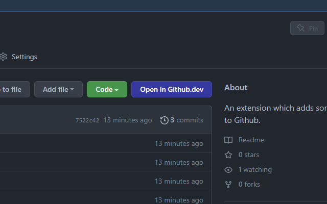

# Github Plus
An extension which adds some functions to Github.

## Features
Currently, just adds "Open in Github.dev" button to controls. An alternative to pressing <kbd>.</kbd> on keyboard.

## Credits
Created and maintained by [@Segilmez06](https://github.com/Segilmez06).
