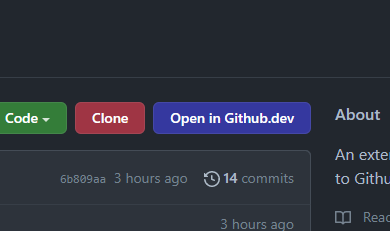
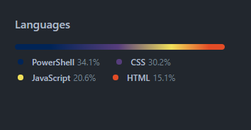

# Github Plus

An extension which adds some functions to Github.

## Get the extension
If you are using Microsoft Edge, use the link below to install the addon. For other Chromium-based browsers, download from [releases page](https://github.com/Segilmez06/Github-Plus/releases) or use unpacked.

 
(Coming to Edge Add-ons soon)

## Features
1) Adds "Open in Github.dev" button to controls. An alternative to pressing <kbd>.</kbd> on keyboard.
2) Adds "Clone" button to controls. You need to run desktop client to use this feature. For client installation, see [here](desktop-client/Desktop-Clients.md).
3) Replaces language bar colors with gradient.

## Screenshots

## Credits
Created and maintained by [@Segilmez06](https://github.com/Segilmez06).
